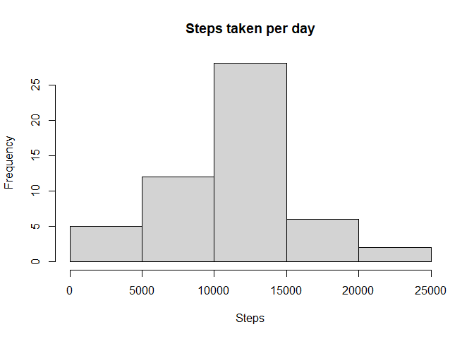
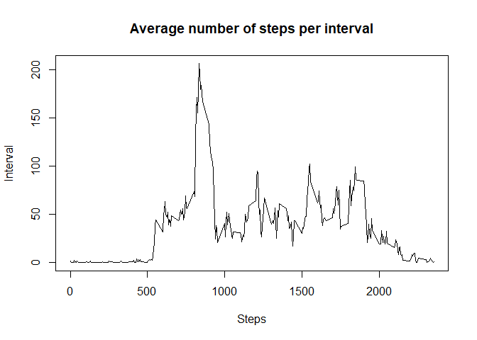
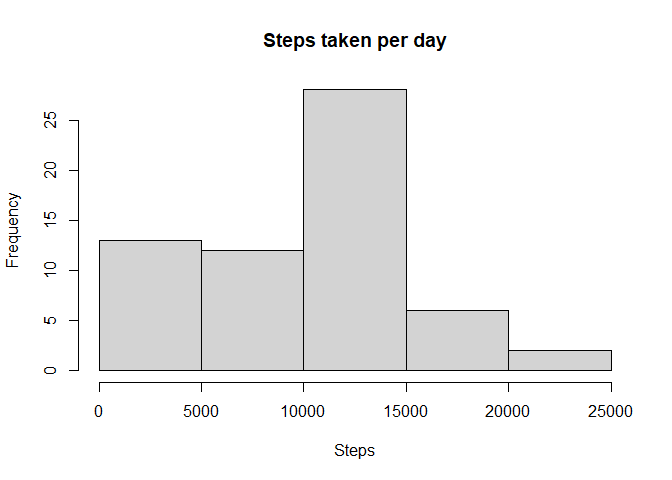
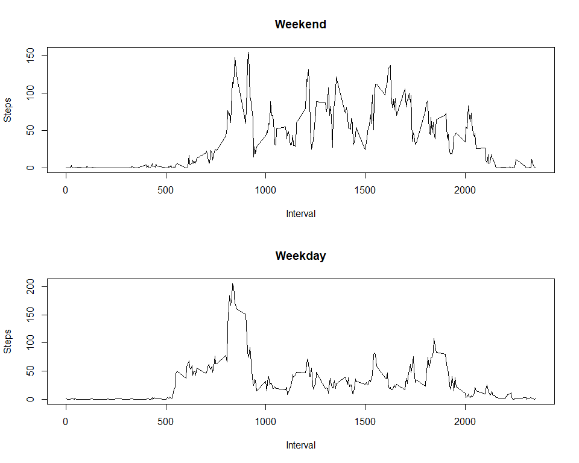

## Loading and preprocessing the data

``` r
Sys.setlocale("LC_TIME", "C")
activity_data <- read.csv(unz("activity.zip", "activity.csv"))
```


## What is mean total number of steps taken per day?

``` r
daily_steps <- aggregate(steps ~ date, data=activity_data, FUN = sum, na.rm=TRUE)
hist(daily_steps$steps, main="Steps taken per day", xlab="Steps")
```

<!-- -->

``` r
#### Mean number of steps
mean(aggregate(steps ~ date, data=activity_data, FUN = sum, na.rm=TRUE)$steps)
```

```
## [1] 10766.19
```

``` r
#### Median number of steps
median(aggregate(steps ~ date, data=activity_data, FUN = sum, na.rm=TRUE)$steps)
```

```
## [1] 10765
```


## What is the average daily activity pattern?

``` r
interval_sum <- aggregate(steps ~ interval, data=activity_data, FUN = mean, na.rm=TRUE)
plot(interval_sum$interval, interval_sum$steps, type = "l", main="Average number of steps per interval", xlab="Steps", ylab="Interval")
```

<!-- -->

``` r
#### Interval that, on average, has the maximum number of steps
interval_sum$interval[which.max(interval_sum$steps)]
```

```
## [1] 835
```

## Imputing missing values

``` r
#### How many rows contain NAs?
sum(is.na(activity_data$steps))
```

```
## [1] 2304
```

``` r
library(dplyr)
# Use the median of the interval for filling NAs
activity_data_enriched <- activity_data %>%
  group_by(interval) %>%
  mutate(steps = ifelse(is.na(steps), median(steps, na.rm = TRUE), steps)) %>%
  ungroup()

daily_steps <- aggregate(steps ~ date, data=activity_data_enriched, FUN = sum)
hist(daily_steps$steps, main="Steps taken per day", xlab="Steps")
```

<!-- -->

``` r
#### Mean number of steps
mean(aggregate(steps ~ date, data=activity_data_enriched, FUN = sum)$steps)
```

```
## [1] 9503.869
```

``` r
#### Median number of steps
median(aggregate(steps ~ date, data=activity_data_enriched, FUN = sum)$steps)
```

```
## [1] 10395
```

#### "What is the impact of imputing missing data on the estimates of the total daily number of steps?"
They decrease because more values are taken into account for which a small number of steps were taken. 


## Are there differences in activity patterns between weekdays and weekends?

``` r
activity_data_enriched$date <- as.Date(activity_data_enriched$date, format = "%Y-%m-%d")
activity_data_enriched$weekday <- weekdays(activity_data_enriched$date)
activity_data_enriched$dayType <- ifelse(activity_data_enriched$weekday %in% c("Saturday", "Sunday"), "weekend", "weekday")

weekend_data <- activity_data_enriched[activity_data_enriched$dayType == "weekend", ]
weekday_data <- activity_data_enriched[activity_data_enriched$dayType == "weekday", ]

parameter <- par(mfrow=c(2,1))
interval_sum <- aggregate(steps ~ interval, data=weekend_data, FUN = mean)
parameter <- plot(interval_sum$interval, interval_sum$steps, type = "l", main="Weekend", xlab="Interval", ylab="Steps")
interval_sum <- aggregate(steps ~ interval, data=weekday_data, FUN = mean)
parameter <- plot(interval_sum$interval, interval_sum$steps, type = "l", main="Weekday", xlab="Interval", ylab="Steps")
```

<!-- -->
